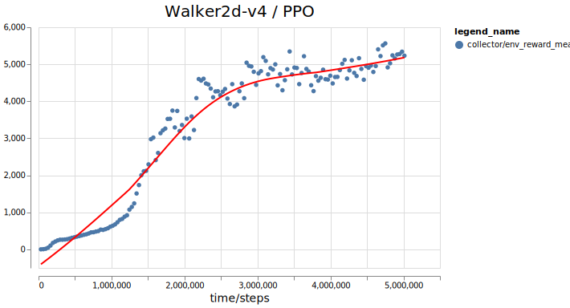
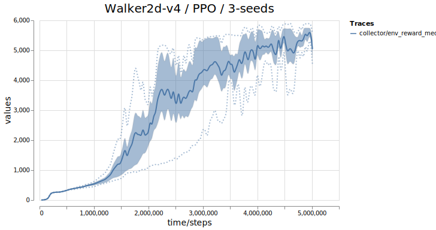

# Modular-Baselines

> :warning: Under Development (In the current version there is no JAX algorithms and network)

Modular-Baselines is a library designed for Reinforcement Learning (RL) research. Our goal is to provide a flexible, easy-to-use set of components that can be combined in various ways to enable experimentation with different RL algorithms. Our components are designed to be framework-agnostic, meaning they don't rely on a specific framework like PyTorch, TensorFlow, or Jax. However, we do include both PyTorch and Jax implementations of some of the algorithms.

To keep the codebase easy to read and maintain, we've implemented each algorithm within a single script using the components provided in Modular-Baselines. Our approach emphasizes duck-typing instead of inheritance, which helps us minimize the dependency between components and algorithms.

### **Algorithms**

| Algorithm |  </img> | </img> |
|:-----:|:---------:|:---------:|
|  A2C  |:x:|:heavy_check_mark:|
|  PPO  |:x:|:heavy_check_mark:|
|  Recurrent PPO  |:x:|:heavy_check_mark:|
|  SAC  |:x:|:x:|
|  TD3  |:x:|:x:|
|  RAINBOW  |:x:|:x:|
|  MPO  |:x:|:x:|
|  CQL  |:x:|:x:|

### **Components**
The algorithms in Modular-Baselines are built using the following components:


|| Components |  </img>  | </img> | </img>|
|:-----:|:-----:|:---------:|:---------:|:---------:|
|**Traces**|  GAE  |:heavy_check_mark:|:x:|:x:|
||  Retrace  |:x:|:x:|:x:|
||  Vtrace  |:x:|:x:|:x:|
|**Buffers**|  Uniform  |:heavy_check_mark:|:heavy_minus_sign:|:heavy_minus_sign:|
||  Prioritized  |:x:|:heavy_minus_sign:|:heavy_minus_sign:|
|  **Collectors** |Rollout| :heavy_check_mark:|:heavy_minus_sign:|:heavy_minus_sign:|
||  Episode  |:x:|:heavy_minus_sign:|:heavy_minus_sign:|
||  Asynchronous  |:x:|:heavy_minus_sign:|:heavy_minus_sign:|
||  Model-Based  |:heavy_minus_sign:|:x:|:x:|
||  MCTS  |:heavy_minus_sign:|:x:|:x:|
|  **Networks** |Shared MLP| :heavy_minus_sign:|:heavy_check_mark:|:x:|
||Separate MLP| :heavy_minus_sign:|:heavy_check_mark:|:x:|
||Atari Encoder| :heavy_minus_sign:|:x:|:x:|
|  **Misc** |Distributional Bellman Loss| :heavy_minus_sign:|:x:|:x:|
- - -
## Logging

Modular-Baselines implements a versatile logging mechanism that includes several features such as data loggers, nested log grouping, writers, and the MB logger that combines everything. With our logging system, you can easily track and monitor your experiments, and record data at different levels of granularity.

Our logging mechanism is designed to be flexible, so you can customize it to suit your needs. For example, you can choose from a variety of data loggers depending on the type of log item that you want to track, and group your logs in different ways to propagate them to the right writers. Writers can dump the reduced log data to different targets (e.g., CSV, JSON, TensorBoard). Finally, ```MBLogger``` provides a convenient way to access all the logging functionality in one place.


The above logger diagram explicitly shows the relation between the log items and the writers. For example; the ```eps_reward``` log item is a ```QueueDataLog``` which contains the last ```n``` values and its ```mean``` is propagated to the writers in the ```progress``` log group. Hence, readers of the code can easily observe how the reported log records are obtained without diving deep into the source code.

- - -
## Installation

Modular Baselines requires pytorch and gym environments.

We recommend that you install ```pytorch``` and ```mujoco``` separately before installing the requirements. 

- [Mujoco](https://github.com/openai/mujoco-py)
- [Pytorch](https://pytorch.org/get-started/locally/) 

Install the requirement packages by running

```bash
conda install -c conda-forge swig # Requirement of box-2d
pip install -r requirements.txt
```

Install the project in development mode

```bash
pip install -e .
```
- - -
## Experiments

We understand that reproducibility is a critical aspect of RL research. To help ensure that your experiments are easily reproducible and never lost, we've integrated the [Sacred](https://github.com/IDSIA/sacred) into Modular-Baselines. Sacred is a Python package designed to handle experimentation in Machine Learning research, and it tracks various aspects of your experiments, such as
- Dependencies
- Source Codes
- Files produced by the experiment
- Configuration
- Git head commit hash

and more.

Modular-Baselines includes several example scripts in the ```examples``` directory. These scripts are used to obtain results within several environments and to validate the implementations. They also serve as a example for your own experiments.

- - -
## Vega Visualizations

Modular-Baselines provides vega-lite Json templates for rendering interactive plots for visualizing the logger outputs. The log files created by the provided JSON writer of a run can be visualized in Jupyter Notebook via the provided functions in ```visualizers/vega.py``` module.

<p float="left">
  
  
</p>


## Maintainers

Modular Baselines has been developed and maintained by [Tolga Ok](https://tolgaok.github.io./) & [Abdullah Vanlıoğlu](https://github.com/AbdullahVanlioglu) & [Mehmetcan Kaymaz](https://github.com/MehmetcanKaymaz).

## Acknowledgments

 This repository is developed at Data & Decision Lab at [ITÜ Artificial Intelligence and Data Science](https://ai.itu.edu.tr).