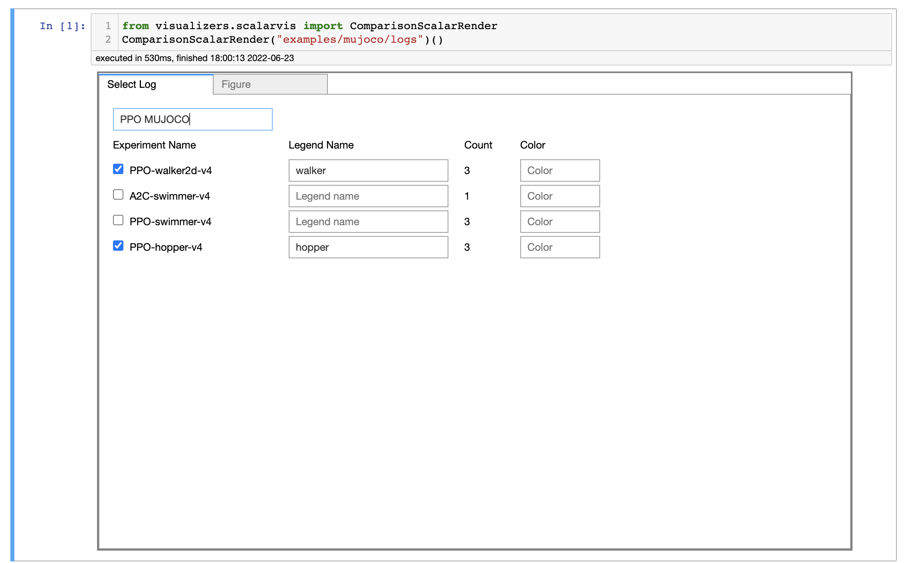
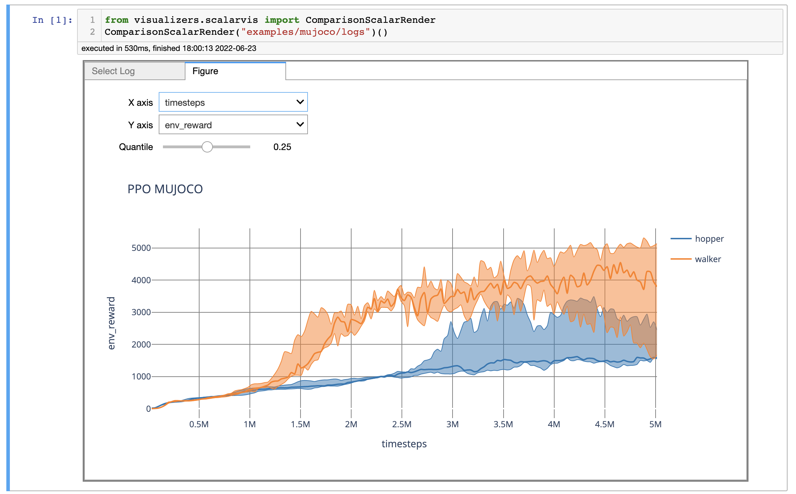

# Modular-Baselines

> Under Development (In the current version there is no JAX agent and network)

Modular-Baselines is a Reinforcement Learning (RL) library, based on [Stable-Baselines3](https://github.com/DLR-RM/stable-baselines3), with the objective of improving flexibility and providing necessary components in RL Research. Components are framework agnostic in the sense that they do not rely on a specific framework. That said, Modular baselines includes both Pytorch and JAX implementations of some of the agents.

| Agent |  </img> | </img> |
|:-----:|:---------:|:---------:|
|  A2C  |:x:|:heavy_check_mark:|
|  PPO  |:x:|:heavy_check_mark:|

- - -
## Design

There are 5 main components in Modular Baselines, namely buffer, collector, agent, algorithm and network. Buffer, Collector and Algorithm are framework agnostic while agent and network depend on the framework of choice.


- - -

## Class Inheritance

Modular Baseline adopts Object Oriented design for modularity. The class structure is shown below.


- - -
## Installation

Modular Baselines requires pytorch and gym environments.

We recommend that you install ```pytorch``` and ```mujoco``` separately before installing the requirements. 

- [Mujoco](https://github.com/openai/mujoco-py)
- [Pytorch](https://pytorch.org/get-started/locally/) 

Install the requirement packages by running

```
conda install -c conda-forge swig
conda install nodejs
pip install -r requirements.txt
```

Install the project in development mode

```
pip install -e .
```

- - -
## Example

You can check out the ```examples``` folder to run tested gym environments.

The log files of the runs can be visualized in Jupyter Notebook via visualizers. See ```visualizers``` folder.

<p float="left">
  
   
</p>

## Maintainers

Modular Baselines has been developed and maintained by [Tolga Ok](https://tolgaok.github.io./).

## Acknowledgments

We thank to the developers and the maintainers of [Stable-Baselines3](https://github.com/DLR-RM/stable-baselines3). This repository is developed at Data & Decision Lab at [ITÜ Artificial Intelligence and Data Science](https://ai.itu.edu.tr).