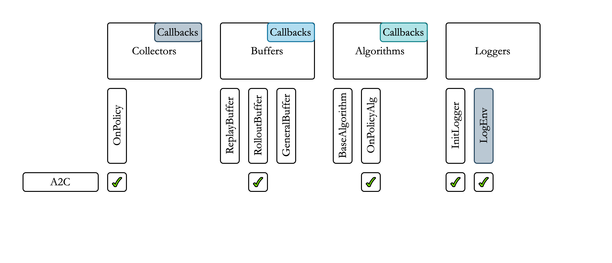

# Modular-Baselines

Modular-Baselines is a Reinforcement Learning (RL) framework, based on [Stable-Baselines3](https://github.com/DLR-RM/stable-baselines3) and [Pytorch](https://pytorch.org), with the objective of improving flexibility in RL Research.

