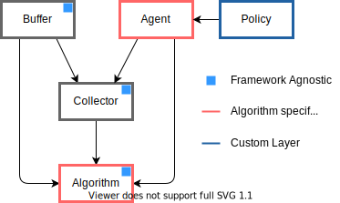

# Modular-Baselines

> Under Development

Modular-Baselines is a Reinforcement Learning (RL) library, based on [Stable-Baselines3](https://github.com/DLR-RM/stable-baselines3), with the objective of improving flexibility and providing necessary components in RL Research. Components are framework agnostic in the sense that they do not rely on a specisifc framework. That said, Modular baselines includes both Pytorch and JAX implementations of some of the agents.

| Agent |  </img> | </img> |
|:-----:|:---------:|:---------:|
|  A2C  |:x:|:heavy_check_mark:|
|  PPO  |:x:|:heavy_check_mark:|

- - -

There are 5 main components in Modular Baselines, namely buffer, collector, agent, algorithm and network. Buffer, Collector and Algorithm are framework agnostic while agent and network depend on the framework of choice.

- - -
Modular Baseline adopts Object Oriented design for modularity. The class structure is shown below.

